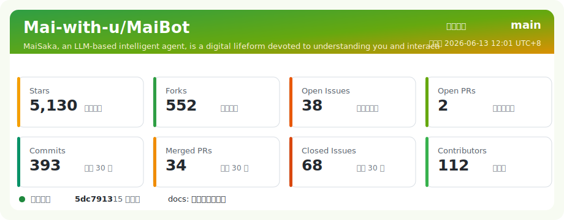

<div align="center">

# MaiBot · DogTwoMey Fork

**Fork + unified workspace for MaiBot ecosystem**

A personal fork of [`Mai-with-u/MaiBot`](https://github.com/Mai-with-u/MaiBot) with a built-in NapCat Adapter plugin and NapCatQQ source submodule, so the complete stack can be deployed, launched, and upgraded from a single repo.

_这是 `Mai-with-u/MaiBot` 的个人 fork。NapCat Adapter 作为默认插件随主程序发布，NapCatQQ 源码通过 git submodule 纳入统一工作区。_

</div>

---

## 🧭 Start here · 从哪里开始

| 如果你想... | 去这里 |
|---|---|
| **部署、启停、配置、运维、排查** | 👉 [**`docs/fork/deployment.md`**](docs/fork/deployment.md) — 工程层文档，新机器从这里开始 |
| 了解本 fork 相对 upstream **业务层** 的设计分歧 | [**`docs/fork/design_divergence.md`**](docs/fork/design_divergence.md) — 二开/合并必读 |
| 了解本 fork 相对 upstream **工程层** 的改动 | [`docs/fork/deployment.md` §0](docs/fork/deployment.md#0-本-fork-相对-upstream-的改动-工程层) |
| 查文档全索引（fork vs upstream 原生） | [`docs/README.md`](docs/README.md) |
| 看具体一次 upstream 合并的处理记录（私有） | [`docs/private/reviews/`](docs/private/reviews/) — 私库 submodule，路人不可见 |

---

## 📦 Components · 组件构成

| 组件 | 上游 | 本仓库路径 | 作用 |
|------|------|----------|------|
| **MaiBot** (主程序) | [Mai-with-u/MaiBot](https://github.com/Mai-with-u/MaiBot) | `./` (仓库根) | 基于 LLM 的聊天机器人本体 (`bot.py`) |
| **NapCat Adapter** | 随 MaiBot 发布 | `src/plugins/built_in/napcat_adapter/`（默认插件） | OneBot ↔ MaiBot 消息桥接，由插件运行时加载 |
| **NapCatQQ** | [NapNeko/NapCatQQ](https://github.com/NapNeko/NapCatQQ) | `external/napcat-src/` (submodule) | QQ 协议注入的 shell 源码，`scripts/build_napcat.py` 构建产物到 `runtime/napcat/` |

本 fork 在 **工程/部署层** 做了大量改造（submodule 布局、统一 launcher、构建脚本、PyCharm run configs、apisource 切换 — 详见 [`deployment.md §0`](docs/fork/deployment.md#0-本-fork-相对-upstream-的改动-工程层)），并在 **业务/代码层** 维持了若干长期分歧（后端路径抽象、本地 dist、@ 保活、孤儿 tool call 兜底、KV cache 日志 revert、可视化 Hook 等 — 详见 [`design_divergence.md`](docs/fork/design_divergence.md)）。合并 upstream 前请阅读后者的"合并前必做清单"。

---

## 🌐 Upstream resources · 官方资源

> 想了解 MaiBot 项目本身（功能、设计理念、贡献指南、发布日志、QQ 社群），请直接访问上游 —— 本 fork 不维护这些。

| 资源 | 链接 |
|------|------|
| 📘 官方文档站 | [docs.mai-mai.org](https://docs.mai-mai.org) |
| 📦 上游 Release | [MaiBot/releases](https://github.com/Mai-with-u/MaiBot/releases) · [NapCatQQ/releases](https://github.com/NapNeko/NapCatQQ/releases) |
| 🪟 Windows 一键包 | [MaiBotOneKey/releases](https://github.com/Mai-with-u/MaiBotOneKey/releases) |
| 📚 上游部署教程 | [docs.mai-mai.org/manual/deployment](https://docs.mai-mai.org/manual/deployment/) |
| 🌱 上游组织 | [github.com/Mai-with-u](https://github.com/Mai-with-u) |
| 🖼 上游 README 原文 | [`docs/README_CN.md`](docs/README_CN.md) · [`docs/README_EN.md`](docs/README_EN.md)（保留备查） |
| 🎥 Demo Video | [Bilibili BV1amAneGE3P](https://www.bilibili.com/video/BV1amAneGE3P) |

| 上游分支 | 说明 |
|------|------|
| `main` | 稳定发布版本 |
| `dev` | 开发测试版本，包含新功能，可能不稳定 |

上游社区入口：技术交流群 `571780722`、`766798517`、[麦麦要当 VTB](https://qm.qq.com/q/wGePTl1UyY)，闲聊群 [麦麦之闲聊群](https://qm.qq.com/q/JxvHZnxyec)，插件开发群 `1036092828`。

---

## ⚡ Quick cheatsheet · 速查

```powershell
# 1. 首次克隆（带 submodule）
git clone --recurse-submodules git@github.com:DogTwoMey/MaiBot.git
cd MaiBot

# 2. 一键初始化（submodule upstream remote + uv sync 主仓 + launcher.toml 模板）
uv run python scripts/bootstrap.py --build-napcat

# 3. 启动 NapCat 与 MaiBot（Adapter 由 MaiBot 插件运行时加载）
uv run python scripts/launcher.py start

# 4. 停止
uv run python scripts/launcher.py stop

# 5. 从上游 sync
uv run python scripts/sync_upstream.py --apply

# 6. 切换 LLM 服务商（比如 DeepSeek high 档）
uv run python apisource/manage.py --provider deepseek --tier high --apply
```

PyCharm 用户：[`.run/`](.run/) 下有预置 Run Configurations（Start All / Stop All / Build NapCat / Sync Upstream / ApiSource Aliyun+DeepSeek High），接通后 IDE 里点就行。

> 📘 详细参数、配置字段、故障排查一律见 [`docs/fork/deployment.md`](docs/fork/deployment.md)。

欢迎参与贡献！请先阅读 [贡献指南](docs/CONTRIBUTE.md)。  
<sub><sup>Contributions are welcome. Please read the <a href="docs/CONTRIBUTE.md">Contribution Guide</a> first.</sup></sub>

---

## 🛡 License

本仓库沿袭上游 **GPL-3.0**。使用前请阅读 upstream 的 [`EULA.md`](EULA.md) 与 [`PRIVACY.md`](PRIVACY.md)。



> 上游原则：本项目完全开源且免费。如果有人向你出售本软件、隐瞒其开源性质或倒卖作为"商品"，均违反协议。
