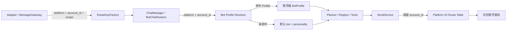

# Multi-Bot 技术设计与实现说明

> 分支：`multi-bot`
> 实现提交：`c44760d49c61846bc6aac1916f426d621659c959`
> 对应变更日志：[Multi-Bot 功能变更日志](../../changelogs/multi-bot.md)

## 1. 目标与边界

本次改动利用现有 Platform IO 的 `platform + account_id + scope` 路由能力，在不复制主进程、数据库和插件运行时的前提下，让不同机器人账号使用不同的身份与人格 Prompt。

设计目标：

1. 保持现有单 Bot 配置和行为不变。
2. 以 `platform + account_id` 精确选择 Bot 身份。
3. 让身份选择覆盖 Planner、Replyer、提及识别、历史恢复和出站发送等核心链路。
4. 不引入新的数据库表、会话 ID 规则或全局上下文切换机制。
5. 配置热重载后无需重建聊天流即可读取新身份。

非目标：

- 不隔离数据库、记忆、学习数据、模型配置和插件状态。
- 不为每个 Bot 创建独立 `MainSystem`、事件总线、插件 Runner 或后台任务。
- 不把 legacy 平台驱动改造成同平台多账号驱动。
- 不引入跨平台稳定 `bot_id`；当前身份键仍是平台账号组合。

因此，这是一层最小侵入的“运行时身份选择”，不是完整多租户架构。

## 2. 现有架构基础

改动前已经存在以下能力：

- `RouteKey` 包含 `platform`、`account_id` 和 `scope`。
- `RouteKeyFactory` 能从入站消息和 `additional_config` 提取账号信息。
- `ChatSession` 保存 `account_id` 与 `scope`。
- `SessionUtils.calculate_session_id` 会把账号和 scope 纳入聊天流 ID。
- Platform IO 出站路由可以按账号绑定具体驱动。

原有缺口是身份和人格仍直接读取进程级 `global_config.bot` 与 `global_config.personality`。即使会话已经按账号分开，两个账号仍会获得相同昵称、人格和回复风格。

## 3. 配置模型

### 3.1 `BotProfileConfig`

新增账号级配置模型，字段如下：

| 字段 | 类型 | 含义 | 运行效果 |
| --- | --- | --- | --- |
| `platform` | `str` | 适配器上报的平台名称 | 参与身份精确匹配；保存时转为小写 |
| `account_id` | `str` | 机器人账号或 self ID | 参与身份精确匹配；去除首尾空白 |
| `nickname` | `str` | 当前账号的显示名和自称 | 注入 Prompt、工具结果、历史和出站消息 |
| `alias_names` | `List[str]` | 当前账号的别名 | 用于人格 Prompt 和名称提及识别 |
| `personality` | `str` | 当前账号的人格描述 | 注入 Planner 与 Replyer 身份段 |
| `reply_style` | `str` | 当前账号的基础表达风格 | 注入 Replyer 系统提示词 |
| `multiple_reply_style` | `List[str]` | 备用表达风格 | 按概率注入单次回复 |
| `multiple_probability` | `float` | 备用风格启用概率 | 限制在 `0` 到 `1` |

`BotConfig.profiles` 保存多个 `BotProfileConfig`。配置加载时会检查重复的 `(platform, account_id)`；重复项会导致配置校验失败，而不是依赖列表顺序选择。

### 3.2 配置版本

主配置模板版本从 `8.14.11` 升至 `8.14.12`。没有新增 `ConfigUpgradeHook`，项目原有配置补全机制会增加空的 `profiles` 字段。

### 3.3 默认行为

`profiles` 默认是空列表。只要没有精确匹配项，解析器就返回原有：

- `global_config.bot.nickname`
- `global_config.bot.alias_names`
- `global_config.personality.personality`
- `global_config.personality.reply_style`
- `global_config.personality.multiple_reply_style`
- `global_config.personality.multiple_probability`

这种回退是明确的向后兼容规则，不会吞掉非法 Profile：空平台、空账号和重复路由仍会在配置加载阶段报错。

## 4. 身份解析层

新增 `src/config/bot_profiles.py`，集中定义：

- `BotRoute`：只要求调用方提供 `platform` 和 `account_id` 的最小协议。
- `BotProfile`：不可变的运行时身份快照，避免业务模块直接持有可热重载的配置对象。
- `resolve_bot_profile()`：按平台和账号解析身份。
- `resolve_bot_profile_for_session()`：从聊天流直接解析身份。

解析算法：

1. 平台去除空白并转为小写。
2. 账号 ID 去除首尾空白。
3. 同时具备平台和账号时，遍历 `bot.profiles` 做精确匹配。
4. 命中后复制字段并返回 `is_default = false` 的快照。
5. 未命中时复制默认 Bot 与 Personality 配置，返回 `is_default = true`。

解析器没有全局缓存。这样配置热重载后，下一次构建 Prompt、解析提及或发送消息时会读取最新配置。

## 5. 运行链路

### 5.1 入站与聊天流

适配器通过以下任一账号字段上报路由信息：

- `platform_io_account_id`
- `account_id`
- `self_id`
- `bot_account`

`RouteKeyFactory` 提取账号后，`ChatManager` 将其保存到聊天流。后续模块以真实 `BotChatSession.account_id` 解析身份，不重新计算资源归属 ID。

### 5.2 Planner

`MaisakaChatLoopService` 根据 `session_id` 取得真实聊天流，再解析 Bot Profile。以下模板参数改为账号级数据：

- `bot_name`
- `identity` 中的昵称、别名和人格描述

效果是 Planner 在决定是否回复、选择工具和组织行为时，使用当前账号的身份，不再始终认为自己是默认 Bot。

### 5.3 Replyer

`BaseMaisakaReplyGenerator` 已持有 `chat_stream`，因此直接从聊天流解析身份。以下数据改为账号级：

- 昵称与别名
- 人格描述
- 基础回复风格
- 备用回复风格
- 备用风格概率

效果是同一进程中的不同账号可以生成明显不同的措辞和自我介绍。

### 5.4 Focus 与内置工具

Focus 模式的唤醒事件、跨聊天事件提示、回复工具成功结果、引导回复写回以及表情包写回均使用当前聊天流的 Bot 名称。

这避免了主 Prompt 已使用账号级人格，但内部事件或工具结果仍显示默认 Bot 名称的上下文冲突。

### 5.5 自身消息和提及识别

`get_all_bot_account_pairs()` 汇总默认账号和所有 Profile 账号，`is_bot_self()` 改为按 `(platform, account_id)` 判断。

具体效果：

- 历史恢复能把所有 Bot 账号发出的消息标记为 `guided_reply`。
- 外部消息间隔统计不会把第二个 Bot 的消息当作用户发言。
- 消息查询的 `filter_bot` 会排除所有 Bot 账号。
- `Person` 遇到 Bot 自身账号时使用对应 Profile 昵称。
- 名称、别名和 `@` 检测使用当前接收账号的身份。

### 5.6 出站发送

`SendService` 优先使用 `BotChatSession.account_id` 构造机器人发送者和 Platform IO 路由；只有聊天流没有账号信息时才读取平台默认账号。

出站消息的 `user_nickname` 使用当前 Profile，WebUI 广播的 `sender.name` 也使用当前 Profile。

效果是身份选择和实际发送账号保持一致，避免“账号 B 使用人格 B 生成回复，却通过账号 A 路由发送”或 WebUI 仍显示默认名称。

## 6. 文件级改动说明

| 文件 | 改动含义 | 实际效果 |
| --- | --- | --- |
| `src/config/official_configs.py` | 新增 `BotProfileConfig`、`BotConfig.profiles`、字段规范化和重复路由校验 | 配置层可以表达多个账号身份，并在启动时拒绝歧义配置 |
| `src/config/bot_profiles.py` | 新增集中式身份解析与不可变快照 | 业务模块不再分别实现账号到人格的映射逻辑 |
| `src/config/config.py` | 配置模板版本更新为 `8.14.12` | 旧配置会由现有升级机制补全新字段 |
| `src/chat/utils/utils.py` | 汇总全部 Bot 账号，按路由解析提及身份 | 第二个及后续账号可被正确识别为 Bot，自身昵称提及正确 |
| `src/chat/message_receive/message.py` | `@` 组件解析接入账号级身份 | 文本化消息中的 Bot 名称与实际接收账号一致 |
| `src/chat/message_receive/uni_message_sender.py` | WebUI 广播解析账号级昵称 | WebUI 消息气泡显示当前 Bot 名称 |
| `src/chat/replyer/maisaka_generator_base.py` | Replyer Prompt 和风格选择接入 Bot Profile | 不同账号使用独立人格和表达风格生成回复 |
| `src/maisaka/chat_loop_service.py` | Planner Prompt 根据真实聊天流解析身份 | Planner 的身份认知与当前账号一致 |
| `src/maisaka/focus/runtime_mixin.py` | Focus 事件使用当前账号昵称 | Focus 提示不会混入默认 Bot 名称 |
| `src/maisaka/runtime.py` | 历史恢复统一调用多账号自身识别 | 第二个 Bot 的历史回复不会被误判为用户消息 |
| `src/maisaka/builtin_tool/context.py` | 内置工具上下文集中获取当前 Bot 名称 | 引导回复、表情包等历史写回名称正确 |
| `src/maisaka/builtin_tool/reply.py` | 回复工具结果使用当前 Bot 名称 | 工具执行结果中的自称和显示名称正确 |
| `src/services/send_service.py` | 出站身份与路由优先使用聊天流账号 | 回复从正确账号驱动发出，并携带正确昵称 |
| `src/common/message_repository.py` | `filter_bot` 支持多个平台账号对 | 记忆和查询场景不会把其他 Bot 账号消息当用户数据 |
| `src/person_info/person_info.py` | Bot 自身人物对象解析账号级昵称 | 人物信息中的 Bot 名称不再固定为默认昵称 |
| `pytests/config_test/test_bot_profiles.py` | 新增解析、回退、校验、模板和 WebUI Schema 测试 | 覆盖配置层和身份解析层的稳定契约 |
| `changelogs/changelog_dev.md` | 增加用户功能与开发侧摘要 | 测试版总变更日志可发现本功能 |

## 7. 兼容性与失败行为

### 7.1 向后兼容

- `profiles` 为空时所有解析均回到原配置。
- 现有 `bot.platform`、`bot.qq_account` 和 `bot.platforms` 继续用于默认账号与 legacy 路由。
- 现有聊天流 ID 算法未修改；已经带有 `account_id` 的会话继续使用原 ID。
- 未新增数据库迁移。

### 7.2 主动暴露的配置错误

以下配置不会静默回退：

- Profile 的 `platform` 为空。
- Profile 的 `account_id` 为空。
- 同一个 `platform + account_id` 配置两次。
- `multiple_probability` 不在 `0` 到 `1` 之间。

这些错误会在配置模型校验阶段完整暴露，避免运行中随机选择错误身份。

### 7.3 路由信息缺失

如果适配器没有上报 `account_id`，系统无法区分同一平台的多个账号，会使用平台默认账号和默认身份。这是接入契约缺失，不应通过猜测群号、用户 ID 或重新计算 hash 兜底。

## 8. 数据隔离边界

不同账号已经拥有独立的聊天流 ID，但仍共享以下进程级或存储级资源：

| 资源 | 当前是否隔离 | 说明 |
| --- | --- | --- |
| 昵称、别名、人格、回复风格 | 是 | 按 `platform + account_id` 选择 |
| 聊天流和上下文 | 基本隔离 | `session_id` 已包含账号路由信息 |
| SQLite 数据库 | 否 | 所有账号仍写入同一个数据库 |
| 人物、关系、表达和黑话学习 | 否 | 部分查询按聊天流，底层存储仍共享 |
| 长期记忆与 A-Memorix | 否 | 没有新增 Bot 命名空间 |
| 模型配置和预算 | 否 | 仍使用同一个 `model_config.toml` |
| 插件实例与插件配置 | 否 | 仍由同一插件运行时管理 |
| 日志、缓存和后台任务 | 否 | 仍属于同一主进程 |
| 故障域和重启 | 否 | 任一全局错误可能影响全部账号 |

需要严格人格、记忆和插件隔离时，应采用 [两个不同人格 MaiBot 的维护方案](multi-persona-deployment.md) 中的多实例部署，而不是扩大本功能的隐式职责。

## 9. 适配器要求

同平台多账号必须满足：

1. 每条入站消息携带真实接收账号 ID。
2. 每个发送驱动用包含账号的 `RouteKey` 注册。
3. 多个连接实例具有不同的 driver ID 或 scope，不能互相覆盖运行状态。
4. 出站时能够根据 `platform + account_id + scope` 找到对应连接。

现有 legacy fallback 的内部结构是“每个平台一个发送驱动”，因此只能作为默认单账号兼容链路。多账号实验应优先使用 MessageGateway/插件驱动。

## 10. 测试与验收

已完成：

- `ruff check`：通过。
- Python 语法编译：通过。
- `pytests/config_test/test_bot_profiles.py`：5 项通过。

建议联调验收矩阵：

| 场景 | 预期结果 |
| --- | --- |
| 账号 A 收到提及 A 昵称 | A 会话识别为提及，使用 A 人格回复 |
| 账号 B 收到提及 B 别名 | B 会话识别为提及，使用 B 人格回复 |
| 账号 B 收到仅包含 A 昵称的消息 | 不因 A 的名称配置误判为提及 B |
| 同一群分别通过 A、B 收到消息 | 形成不同 `session_id`，上下文不交叉 |
| A、B 分别发送回复 | Platform IO 选择各自账号驱动 |
| 重启并恢复历史 | A、B 的历史回复都识别为 Bot 自身消息 |
| 删除 B 的 Profile 后热重载 | B 后续请求回到默认身份 |
| 配置重复的 B Profile | 配置加载失败并显示重复路由错误 |

## 11. 后续演进建议

如果要从实验能力演进为完整单进程多 Bot，应按以下顺序推进：

1. 引入稳定 `bot_id`，将多个平台账号绑定到同一逻辑 Bot。
2. 把 `bot_id` 加入消息、会话、工具执行和 Hook 上下文。
3. 为记忆、人物、表达、黑话和统计数据增加明确的 Bot 命名空间。
4. 支持 Bot 级模型策略、插件启用范围和权限配置。
5. 让 MessageGateway 支持同一插件的多个具名连接实例。
6. 补充双账号端到端测试，包括入站、Prompt、工具调用、发送、重启恢复和热重载。

在上述隔离完成前，文档和 UI 应继续使用“账号级身份配置”描述本功能，避免将其宣传为完整的多租户人格隔离。
